# The World Bracelet Championship - Project 1 - Humberto Ragazzini

Welcome to the fiercest championship around the world, The Bracelet Championship is
A game where your memory will be put into the limits.
You will need to make a bracelet following different patterns of Jewels. Each error or
triumph will affect your final score, try now and remember each jewel counts…
GOOD LUCK! 

In order to access the website and visit it, you can do it by the following GitHub link: [TBWC](https://humbertoragazzini.github.io/the-world-bracelet-championship-ms2/)

# **UX**


## **Strategy**

* **My idea**: The original idea was born when I watched my wife create real bracelets, to
This she needed to memorize each pattern and repeat them several times so that
The bracelet looks with a certain geometric shape, at that moment I thought
Why not transfer that complexity into a game. That was the trigger to make this Idea real.

* **Make an impact in the first visit**: The main page had to be colorful and imposing to make the first sight enjoyable and at the same time intriguingly fun.
For this reason, the first page would have a mix between the bracelet and an athlete's jackpot, a golden belt.

* **My Goal**: The objective is to give the player a good time and a challenge. With these two elements draw the attention of the player to break the scores.

* **User Goals**: These goals sound like my own goals, not only because we would share a love for games but also to find a unique moment and enjoy that little free time with a memory game.

-----------------------------

## **Scope**

* **The principal feactures of the proyect:**
    * The possibility to save records in the local storage.
    * Save the Name of the user who play the game.
    * The maximum level reached by all the users who play the game.
    * The possibility to see these records by order.
    * Have 3 main areas, but the game itself be smooth, without any reload time.
    * Plenty number of jewels to make every level in the game unique.
* **Full Mobile Game:**
    * The game must be full responsive prioritizing mobile devices.
    * Adapt the layout with most of the screen resolutions.
* **The principal features of the project:**
    * Online gameplay between two players.
    * Time limit in single player and multiplayer game.
    * A international database with all players records.
    * The posibility to earn badget (prices) depending of level and records to given more progression to the game
    * Full social media integration

-----------------------------

## **Structure**

In this section the basic structure will be outlined, and how the information will be presented.

* **What a guest would like to see the first time**
    * Colorful and animated start menu
    * The sections are organized by start game, a contact area, and if some player would like to read how the game was created a small about us section will be able to see.

* **How I present this sections**

    * First an epic start: The first view in the game a price, a big golden belt with the start button ready to be clicked or pressed.
    * After the start menu: Create new player option with the all the records in a table to make them easy to read.
    * In the game: The player needs a smooth transition between a loss and a new game, with minimum or without loading times, if it’s possible in the same index.
    * A contact section: Here a small form to share opinions about the game or future new features, and if is any bug to be reported.
    * An About Us section: this game was created by a seed, a small seed from something there I saw, in this section I explain how this grow.
        
-----------------------------

## **Skeleton**

### **First ideas**

In this section I present some of the first designs and the development of the first ideas to a more visual wireframe. [Click Me](https://github.com/humbertoragazzini/the-world-bracelet-championship-ms2/blob/master/readme-files/image/firstideas/first-idea.jpg)

### **Wireframes**

With the drawers I tried to place all in a more visual wireframe to have a better idea of the final future design

* **Desktop Start Menu with rain of jewels:**[Click Me](https://github.com/humbertoragazzini/the-world-bracelet-championship-ms2/blob/master/readme-files/image/wireframes/wirefram-desktop-start.png)

* **Mobile Start Menu with rain of jewels:**[Click Me](https://github.com/humbertoragazzini/the-world-bracelet-championship-ms2/blob/master/readme-files/image/wireframes/wirefram-mobile-start.png)


* **Desktop in game level:**[Click Me](https://github.com/humbertoragazzini/the-world-bracelet-championship-ms2/blob/master/readme-files/image/wireframes/wirefram-mobile-desktop-game.png)


* **Mobile in game level:**[Click Me](https://github.com/humbertoragazzini/the-world-bracelet-championship-ms2/blob/master/readme-files/image/wireframes/wirefram-mobile-game.png)


* **Desktop and Mobile contact:**[Click Me](https://github.com/humbertoragazzini/the-world-bracelet-championship-ms2/blob/master/readme-files/image/wireframes/wirefram-mobile-desktop-contact.png)


* **Desktop and Mobile about us:**[Click Me](https://github.com/humbertoragazzini/the-world-bracelet-championship-ms2/blob/master/readme-files/image/wireframes/wirefram-mobile-desktop-aboutus.png)

-----------------------------

## **Surface**

The colors were selected by looking the different bracelets made by my wife.

Before starting to make the index code, I did a research on what are the most common resolutions for mobile phones and PCs around the world

The most common mobile resolution is:

Resolution | Mobile percentage
------------ | -------------
360x640  | 10.77%
414x896 | 7.37%
360x780 | 5.9%
375x667 | 5.56%
360x800 | 5.52% 
360x760 | 5.15% 

Data taken from _[statcounter](https://gs.statcounter.com/screen-resolution-stats/mobile/worldwide)_

For this reason i get to the body a minimum width of 360px to ajust to the bast majority of them.

For desktop screen resolution the numbers are different

Resolution | Desktop porcentage
------------ | -------------
1920x1080  | 20.99%
1366x768 | 20.23%
1536x864 | 9.72%
1440x900 | 6.23%
1280x720 | 5.45%
1600x900 | 3.47%

Between the 1080px and 768px resolution we have almost the 50% of the users, if we add 768px, 864px and 900p we have more than 60% of the users.

### **The big Start**

The big start button is in the beginning of the page, I try to bestow to the site the real feeling of a mobile or computer game, so I focused my design in some basic main menu game adding to this big button a golden metal belt with jewels, and to provide even more glamorous colorfulness we add a nice jewel rain (this rain is a random positioning jewels with width limited in real time).


### **The new game section**

- Here we have on the top the best score, the level in the game, and a small navbar with the home contact and about us icons, the two squares with score and record contains animation when the player go through the levels.

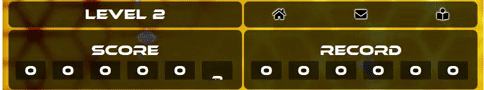

- In the middle of this section, we have the text area for a new name, this name cannot contain space or symbols, next or below this text section we put a green button, this button creates the new player and start the new game, we add some notifications, alerts to tell the user to fill up the player’s name before starting the game. Below the new player segment, we add a table with all the records of every single player until reach the amount of 8.


### **The new contact section**

- The contact place has a contact form with the option to send a message to the developer, all the fields are required, and we add pop-ups about error and confirmation email.

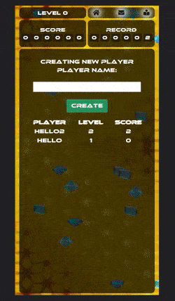

### **The new about us section**

- About us is a small piece of text telling the story of who, how and why this game was developed, it is small but an important paragraph

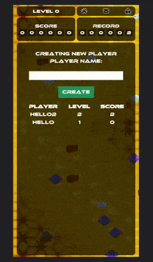

### **Overview of the whole site**

- This is an overview of the site in a mobile device mode:

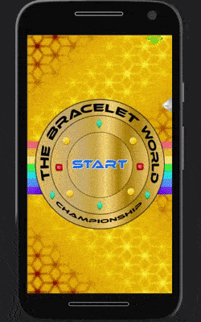
    
-----------------------------

# **Testing**

## **Responsive**
    
The site it has made to be responsive between 360p to up to 4160px:
    
* Image to show the responsive design in the web site: 
   
    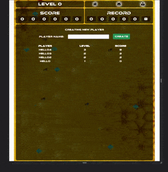
    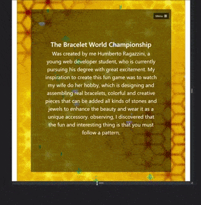

## **Validators**

**I did the validation for every single page, this are the result:**

* **HTML validation**

    * Index validation:
    
    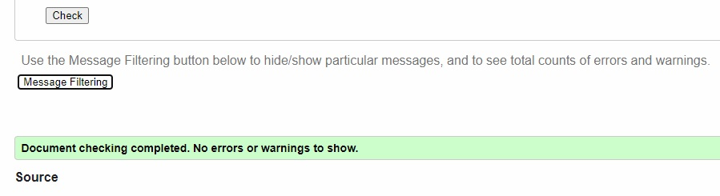


    * Contact validation:
    
    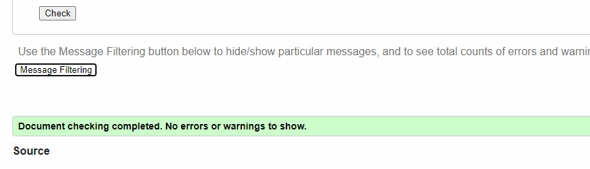


    * About Us validation:
    
    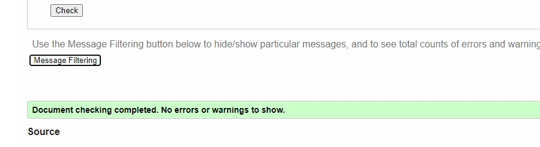

* **CSS validation**

    * Css validation result landscape & portrait:

    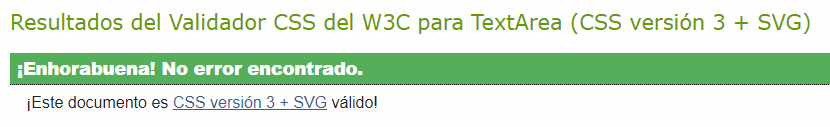

* **JShint validation**

    JShint validator (some warnings are because i split the js into a couple of files, so for this reason some functions are variables from others js files):

    * ANIMATION.JS:
        * 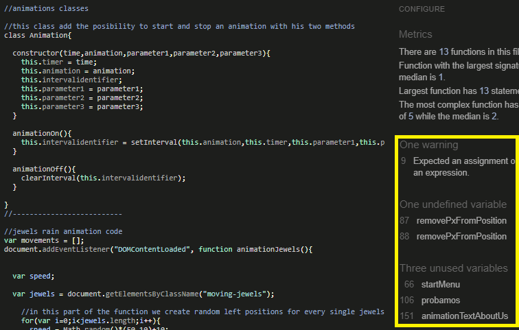
    * GAME.JS:
        * 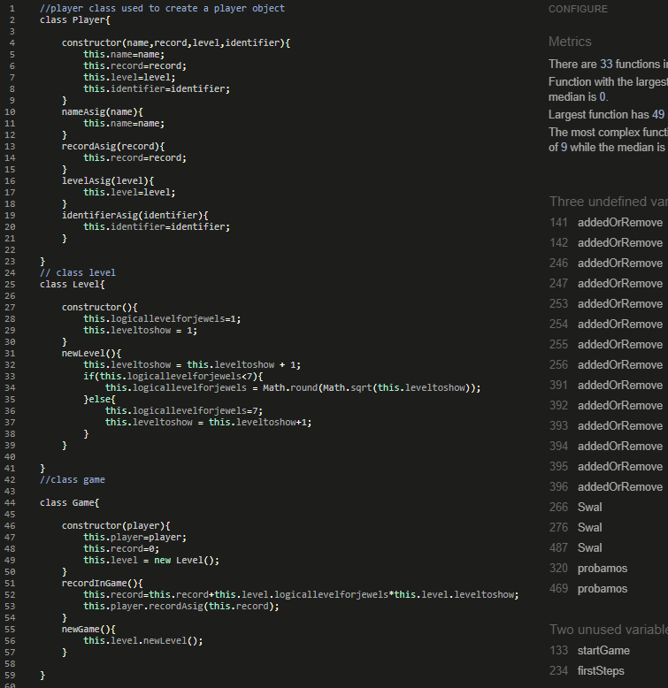
    * SENDEMAIL.JS:
        * 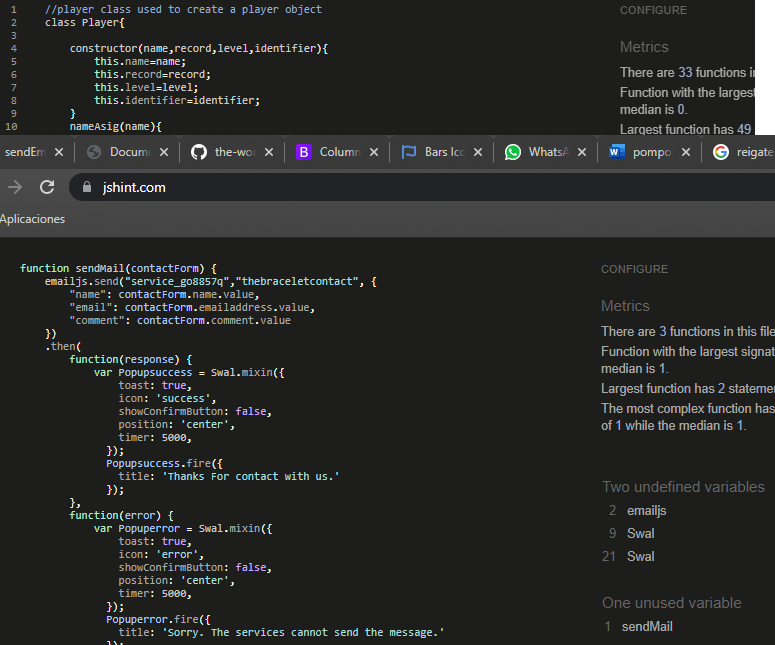
    * UTILITIES.JS:
        * 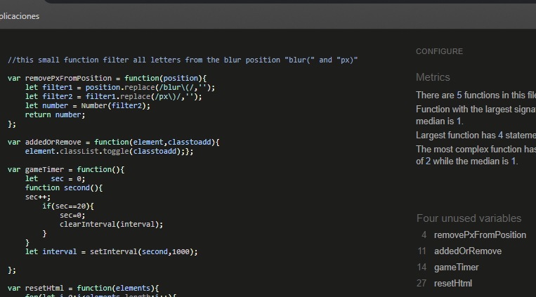

## **Testing Web Site**

## **Testing Web Site**

* Home Page:
    - Tested:
        1) Animation working
        2) Start button working
        3) Layout okay across all devices
 
            
* About Us:
    - Tested:
        1) Animation working
        2) Text animation okay
        3) bootstrap menu working perfect
        4) Layout okay across all devices
        5) Records table game working perfet
        6) buttons working
        7) Text name input for new player ok.
        8) Jewel selector, jewel color selector, pop-up, random jewel pop by level working okay
        9) When lose, all pop-up working record saved in local storage, and restore to fill table.
        10) All buttons working
        11) All icons from navbar working ok.

            
* Contact:
    - Tested:
        1) Animation working
        2) Text input, name input and comment input working okay
        3) bootstrap menu working perfect
        4) Layout okay across all devices
        5) Send message working, popup okay and error working perfect

## **Unfixed Bugs**

* I did not find any errors, the website was tested on the following devices:
    - Samsung s9+ (Android) Ver. 
        - Web Browsers: 
            - EDGE: Microsoft Edge Versión ver.46.06.4.5161
            - Chrome: Versión 92.0.4515.159 (Build oficial) (64 bits)
            - Mozilla: 88.0.1 (64-bit)
            - Opera: Opera 75 Release date	2021-03-24
    - Galaxy Tab S4 (Android) Ver.10 - 4.4.205-19646842
        - Web Browsers: 
            - EDGE: ver.46.04.4.5157
            - Chrome: ver.91.0.4472.77
            - Mozilla: ver.88.1.3
            - Opera: ver.63.3.3116.58675
    - Pc (windows 10) Ver.20H2 - 19042.985
        - Web Browsers: 
            - EDGE: Versión 92.0.902.73 (Compilación oficial) (64 bits)
            - Chrome: Versión 92.0.4515.159 (Build oficial) (64 bits)
            - Mozilla: 90.0.2 (64-bit)
            - Opera: Opera 75 Release date	2021-03-24
    - PC (Linux Ubuntu) Ver. 
        - Web Browsers: 
            - Mozilla:  
    - Iphone 12 Pro (IOS) ver.14.6
        - Web Browsers:
            - Zafari: ver. 14
            - The game after selecting the jewel gives the lost game message, which is wrong, unfortunately, I have no way to debug the error, because in my economic situation I cannot spend on an iphone, mac, or a subscription to a page such as https://www.browserstack.com/ All of these sites only give me between 1 and 5 minutes, so it is impossible to verify what the error is..

# **Frameworks and Tecnologies**

- HTML5

- CSS

- JS

- BOOTSTRAP 5 - _[bootstrap](https://getbootstrap.com/)_.

- GITPOD - _[gimp photo editor](https://imagen.online-convert.com/es/convertir/mp4-a-gif)_.

- GITHUB - _[github](https://github.com/)_.

- W3C VALIDATOR - Validator html and css: _[w3c validator](https://validator.w3.org/)_.

- JShint validator - Validator js: _[js validator](https://jshint.com/)_. 

- GIMP - GIMP photo editor: _[gimp photo editor](https://www.gimp.org/)_.

- ACTION SCREEN RECORDER - Screen recorder: _[ACTION](https://mirillis.com/es/productos/action-grabacion-de-pantalla-y-videojuegos.html)_. 

- Resolve Video Editor - _[Resolve](https://www.blackmagicdesign.com/products/davinciresolve/)_.

- ONLINE-CONVERTER - Video to gif: _[Online converter](https://imagen.online-convert.com/es/convertir/mp4-a-gif)_.

- GOOGLE FONT - Google fonts: _[google font](https://fonts.google.com/)_.

# **Deployment**

## To deploy my project:

1) Go to my github main page and login in.

2) Select the repository, in this case :[Git Hub Repository](https://github.com/humbertoragazzini/the-world-bracelet-championship-ms2).
    
3) In this tab select settings.
    
4) Click in pages in the option menu.
    
5) Select in source branch master.
    
6) Save, the project is deployed in github pages in the following link:[TBWC](https://humbertoragazzini.github.io/the-world-bracelet-championship-ms2/)

## **To clone my repository in github**

To clone de repository follow this steps:

1)
    1.a) In my repository you can click in download.

    1.b) Safe the file an after that uncompressed the file in you desired directory.

    1.c) Now you can open the project with any IDE.

2)
    2.a) First of all we need to install git from this link [GitBash](https://git-scm.com/downloads) .

    2.b) After install gitbash in the command prompt select the path where you prefer to save the files.

    2.c) Execute the command in gitbash:
    ```git clone https://github.com/humbertoragazzini/the-world-bracelet-championship-ms2.git ```

    2.d) After this you now can open the project with any ide such a Visual Studio.

# **Credits**


## **Content**

**The text:**
- I have written all the web site text, my wife helped me to fixed them. (Thanks to Yamile Simes)

**The form:** 
- part of the code was utilized from the official bootstrap website and the code institute learning page
_[bootstrap form address](https://getbootstrap.com/docs/5.0/forms/overview/)_.

**The icons:** 
- the icons were used from the font awesome website; The link was provided by the code institute learning page
_[font awesome web site](https://fontawesome.com/)_.

**The fonts:**  
- From dafont _[font dafont](https://www.dafont.com/ethnocentric.font/)_.

**Navmenu (desktop):**
- I used it from code institute learning videos, and make some modifications

**Navmenu (mobile):** 
- Utilized it from bootstrap dropdown and navbar menus.
_[navbar bootstrap](https://getbootstrap.com/docs/5.0/components/navbar/)_ / 
_[dropdown menu bootstrap](https://getbootstrap.com/docs/5.0/components/dropdowns/)_.

**Alerts**
- Taked from sweetalert2 a really nice project.
_[sweetalert2](https://sweetalert2.github.io/#usage)_ / 

## **Media**

**Background**: made with GIMP on windows.

**Colors**: maded based in the boxing belt from wba and rainbow

**Videos**: 

- Edited with Resolve. 
- Recorded with Action.

**Gif**
- Edited and Converted with onlineconverter _[online converter](https://www.onlineconverter.com/)_.